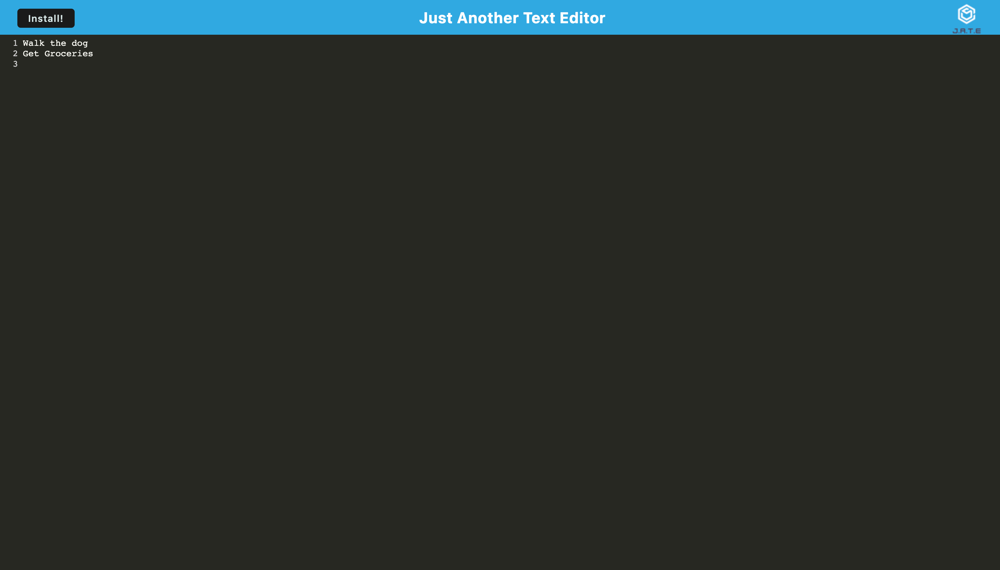

# Just Another Text Editor - JATE Module 19 Challenge

## Table of Contents

-- [Description](#description)

-- [Installation](#installation)

-- [Screeenshot](#screenshot)

-- [Deployed Link](#deployed-link)

-- [GitHub Project Link](#github-project-link)

-- [Contact](#contact)

## Description

The purpose of this project is to create a progressive web application that will allow the user to create code snippets with or without an internet connection.  This app will use utilize webpack and indexeddb to help with making the progressive web application to create code snippets even if there is no internet connection.  

## Installation

To install locally run 'npm i' and then run 'npm start' 

You can then go locally to http://localhost:3000 to view the app.

## Screenshot

## Deployed Link

https://jf-pwa-text-editor.herokuapp.com/

## GitHub Project Link

https://github.com/j-faust/pwa-text-editor

## Contact

https://github.com/j-faust/